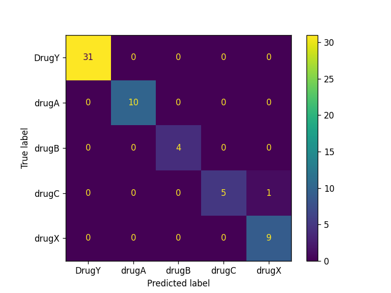

# Continuous Integration, Continuous Deployment for Machine Learning
Demo for automating model training, evaluation, versioning, and deployment using GitHub Actions and Hugging Face Spaces.

# Project Description
In this project, we will be using scikit-learn pipelines to train our random forest algorithm and build a drug classifier. After training, we will automate the evaluation process using CML. Finally, we will build and deploy the web application to Hugging Face Hub.

From training to evaluation, the entire process will be automated using GitHub actions. Upon pushing the code to the GitHub repository, the model will be updated on Hugging Face with the updated app, model, and results.

# Pipeline
        +---------------+         +-----------------+
        |   Code Files  |         |      Data       |
        +---------------+         +-----------------+
                |                          |
                |                          |
                v                          v
        +-------------------------------------------+
        |              Local Repository             |
        +-------------------------------------------+
                              |
                              |
                     git push | 
                              |
                              v
    +-------------------------------------------------------+
    |                      GitHub Actions                   |
    +-------------------------------------------------------+
    |                                                       |
    |                     On push to main:                  |                        
    |                                                       |
    |   +-----------------------------------------------+   |
    |   |           Continuous Integration              |   |
    |   +-----------------------------------------------+   |
    |   | +-----------------+       +-----------------+ |   |
    |   | |      Train      | ----> |      Model      | |   |
    |   | +-----------------+       +-----------------+ |   |
    |   |                                    |          |   |
    |   |                                    v          |   |
    |   |                           +-----------------+ |   |
    |   |                           |     Evaluate    | |   |
    |   |                           +-----------------+ |   |
    |   +-----------------------------------------------+   |
    |                         |                             |
    |     On CI completion:   |                             |
    |                         v                             |
    |   +-----------------------------------------------+   |
    |   |           Continuous Deployment               |   |
    |   +-----------------------------------------------+   |
    |   | +-----------------+       +-----------------+ |   |
    |   | |    Pull Files   | ----> |   Upload Model  | |   |
    |   | +-----------------+       +-----------------+ |   |
    |   |                                    |          |   |
    |   |                                    v          |   |
    |   |                           +-----------------+ |   |
    |   |                           |    Deploy App   | |   |
    |   |                           +-----------------+ |   |
    |   +-----------------------------------------------+   |
    |                                                       |
    +-------------------------------------------------------+

## Pipeline Explanation

1. **Code Files** and **Data** are pushed to the **Local Repository**.
2. On a `git push`, **GitHub Actions** is triggered to run Continuous Integration:
   - The pipeline trains the model and evaluates its performance.
3. Upon CI completion, the Continuous Deployment phase begins:
   - The trained model is pulled, uploaded, and deployed as an application.

This process ensures automated integration and deployment for seamless development workflows.

# Model Performance

### Evaluation Metrics
| Model                  | Accuracy | F1 Score |
|------------------------|----------|----------|
| RandomForestClassifier | 97.0%    | 94.0%    |

### Confusion Matrix
